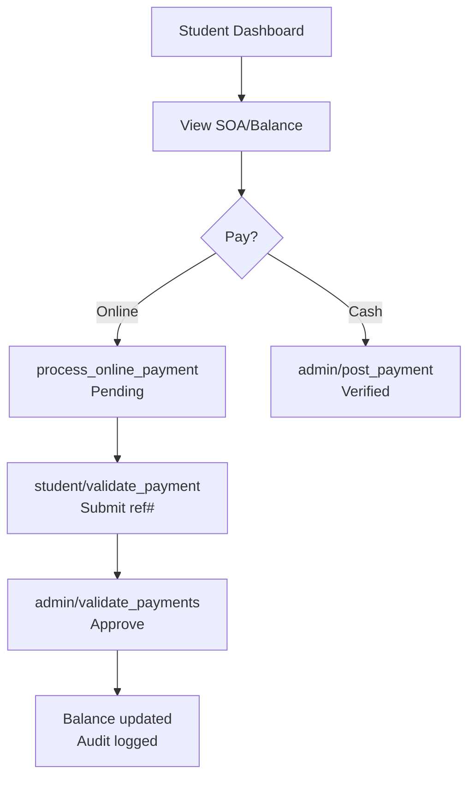

# SIEMS System Overview
## Complete Process, Subsystem Features, End-to-End Flows

**Student Integrated Education Management System (SIEMS)**  
A monolithic PHP/MySQL web application for full campus operations under XAMPP (c:/xampp/htdocs/siems). Uses unified DB `siems_unified` with 50+ tables. Organized into 10 subsystems (sub1-sub10), each with designated admin accounts (e.g., SUB6ADMIN). Single login authenticates role/subsystem access -> dashboard redirect.

## 1. Overall System Process & Architecture

### Core Layers
```
┌─────────────────────┐   ┌──────────────────┐   ┌─────────────────┐
│   Presentation      │──▶│   Business Logic  │──▶│     Data        │
│   (PHP pages,       │   │   (includes/      │   │   (MySQL DB     │
│    Bootstrap UI)    │   │    functions.php) │   │    siems_unified)│
└─────────────────────┘   └──────────────────┘   └─────────────────┘
         │                        │                        │
         ▼                        ▼                        ▼
   Subsystem Folders       calculateAssessment()       50+ Tables
   (sub1-sub10)            postPayment()              users, payments,
                            resolveUserHomePath()     enrollments, etc.
```

### Authentication Flow
```mermaid
graph TD
    A[User visits index.php] --> B[Login form]
    B --> C[POST process_login.php]
    C --> D{Valid user?}
    D -->|No| E[Error: login.php]
    D -->|Yes| F{Check role/active?}
    F -->|Invalid| E
    F -->|Valid| G[resolveUserHomePath()]
    G --> H[Redirect to dashboard<br/>e.g. admin/dashboard.php]
    H --> I[Session sets user_id, role, student_id]
```

## 2. Features per Subsystem

### Payment Subsystem (sub6) - Fully Detailed
**Location**: payment(sub6)/  
**Roles**: admin (cashier), student (self-service)  
**Key Files**: admin/dashboard.php, student/dashboard.php, includes/functions.php  
**Features**:
- **Assessment**: `calculateAssessment(student_id)` - Tuition (per unit), misc/registration fees, scholarships.
- **Payments**: Cash posting, online (GCash/Maya) pending->admin verify.
- **Scholarships**: Apply/validate discounts (50-100%).
- **Documents**: Request (TOR, enrollment cert) -> pay -> claim.
- **Store Sales**: Items (uniforms/books) -> online/cashier order -> claim slip.
- **Reports/Audit**: Collections, audit_log per action.

**Tables**: users, student_assessments, payments, fee_configs, scholarships, document_requests, store_items, item_orders, audit_log.

### Other Subsystems (Inferred from Schema/DB)
| Subsystem | Likely Focus | Key Features/Tables | Admin Example |
|-----------|--------------|---------------------|---------------|
| Enrollment/Registration | Academic signup | Applications, validations, prerequisites | SUB1ADMIN |
| Academics/Grading | Subjects, schedules, grades | enrollments, class_schedules, grades, curriculum | SUB2ADMIN |
| HR/Employment | Job postings, applicants | job_postings, applicants, employee_records | SUB3ADMIN? |
| Clinic/Medical | Consults, clearances | clinic_consultations, medicines, medical_records | CLINIC001 |
| General Admin | Users, notifications | users, notifications, roles | ADMIN001, SUB*ADMIN |

**Note**: Other sub folders (sub1-sub5?) likely mirror payment(sub6) structure. All share unified DB; audit_log tags by 'subsystem'.

## 3. Overall End-to-End Flows (First to Last)

### Student Lifecycle Flow


### Payment Workflow (sub6 Example)


### Staff/Subsystem Flow
1. Login (SUB6ADMIN) -> admin/dashboard.php
2. Manage: post payments, validate online, scholarships, store orders.
3. Cross-subsystem: Shared data (e.g., enrollment triggers assessment).

## 4. Key Business Rules
- **Balance**: Gross assessment - verified tuition payments (excludes doc/store).
- **Access**: Staff must be 'designated' via isDesignatedStaffAccount().
- **Audit**: Every action logged (user_id, subsystem, action).
- **Notifications**: Student alerts (enrollment, payments, claims).

## 5. Technology & Deployment
- **Stack**: PHP 8+, MySQL/MariaDB, Bootstrap 5, PDO.
- **Run**: XAMPP -> http://localhost/siems/
- **DB Setup**: Import siems_unified.sql + payment_system.sql.
- **Demo Accounts**: ADMIN001, SUB6ADMIN, 2024001 (pass: password).

**Last Updated**: From codebase analysis (payment/sub6 focus).
```

<xai:function_call name="edit_file">
<parameter name="path">c:/xampp/htdocs/siems/TODO.md
